# 电网网络安全数智分析平台使用手册

本文档介绍平台界面和主要功能的使用方法。

## 目录

1. [第一章 界面整体介绍](#第一章-界面整体介绍)
2. [第二章 大模型功能使用](#第二章-大模型功能使用)

# 第一章 界面整体介绍

## 1.1 第一页：数智运营大屏

第一页用于展示平台运行概况。页面按照左栏、中栏和右栏组织多个监控组件，使用者可以在不进入具体查询页面的情况下，快速了解当前受控资产、告警风险、网络拓扑和 AI 会话状态。

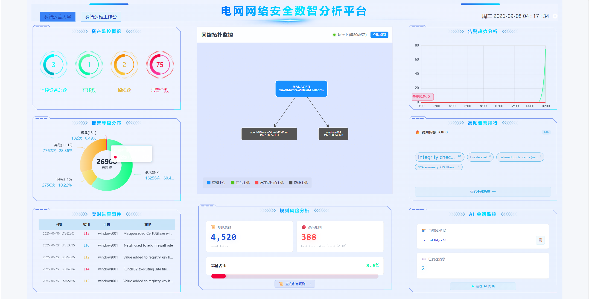

### 1.1.1 左栏：资产与告警概览

**资产监控概览**。该组件以横向统计列表展示当前受控资产的总体情况，包括监控设备总数、在线设备数、掉线设备数和告警数量。使用者可以先通过这里判断当前纳管范围和设备在线情况，再结合其他组件进一步查看异常资产或告警详情。

**告警等级分布**。该组件使用环形图展示告警等级构成，并在图表中心显示告警总数。告警按照等级划分为低危、中危、高危和极危四个区间，分别使用不同颜色区分；每个区间同时显示告警数量和占比，便于快速判断当前告警是否集中在较高风险等级。

**实时告警事件**。该组件以滚动列表展示近期高风险告警，列表包含发生时刻、告警级别、主机和告警描述等信息。告警会按照级别使用不同颜色标识，鼠标悬停在列表上时可以暂停滚动，方便阅读较长的告警内容。发现需要进一步调查的记录后，可以转到第二页的告警查询或 AI 对话窗口继续处理。

### 1.1.2 中栏：网络拓扑与规则风险

**网络拓扑监控**。该组件以中心管理节点和周围受控设备节点展示当前网络管理关系。绿色节点表示设备在线且状态正常，红色节点表示存在威胁或异常，灰色节点和虚线连接表示设备当前离线。通过拓扑关系可以快速定位异常设备，并作为后续资产查询和攻击溯源的入口。

**规则风险分析**。该组件根据规则等级统计规则总数和高危规则数量，并使用进度条展示高危规则占比。高危占比会被划分为低风险、中风险或高风险，并通过文字和颜色进行提示。点击“查询所有规则”可以跳转到第二页的“规则查询”，继续查看规则详情。

### 1.1.3 右栏：告警趋势与 AI 会话

**告警趋势分析**。该组件以时间曲线展示当天从零点开始的告警变化情况，并按告警等级区分不同曲线。使用者可以通过曲线观察告警数量是否在某个时间段集中上升，高风险曲线还会标记当天的风险峰值，便于确定重点分析时段。

**高频告警排行**。该组件统计最近 24 小时内出现频率较高的告警描述，过滤低等级告警后按出现次数取前若干项，并以词云方式展示。词语字号越大，表示出现次数越多；文字和边框颜色用于提示该类告警的最高风险等级。点击“查看全部告警”可以进入告警查询页面查看原始记录。

**AI 会话监控**。该组件用于显示当前 AI 对话会话的基本状态，包括当前线程和已发送的用户提问数量。点击“前往 AI 终端”可以直接进入第二页的 AI 对话窗口，继续进行规则生成、攻击溯源或事件响应操作。

## 1.2 第二页：数智运维工作台

第二页是平台的主要操作页面。左侧为功能导航，中间和右侧显示当前选中的功能内容。菜单按照 AI 智能助手、告警与威胁、资产与监控、日志与漏洞、可视化分析进行分组。

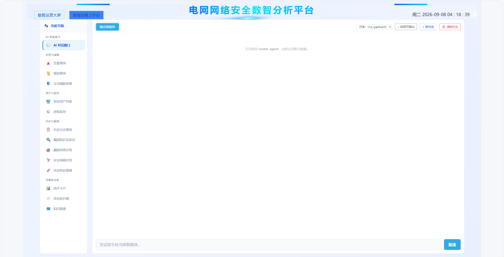

### 1.2.1 AI 智能助手

**AI 对话窗口**是第二页的统一智能操作入口，支持规则生成、攻击溯源和事件响应三项功能。使用者可以直接输入自然语言需求或粘贴日志，系统根据请求选择相应的处理流程，并在需要执行变更操作时等待确认。

窗口顶部的“启用可视化”只和攻击溯源功能相关，按钮默认开启。该设置只在新调查开始时读取，调查开始后切换不会影响当前调查。攻击溯源完成后，可以在“战术卡片”和“攻击拓扑图”中查看可视化结果。

### 1.2.2 告警与威胁

**告警查询**包含“近期告警”和“历史查询”两个标签页。近期告警可以按时间范围和告警等级筛选，并以列表方式查看告警；历史查询支持关键字搜索、精确或模糊匹配及分页查看。使用者通常可以先在这里定位需要分析的日志，再将日志复制到 AI 对话窗口。

**规则查询**用于查看已有规则。使用者可以依次选择字段、操作符和值构造查询条件，结果以规则卡片显示，并包含规则 ID、等级、描述和所属文件等信息。点击规则卡片后可以打开规则源码预览，核对规则的具体内容。

**主动威胁排查**用于联动查看实时告警日志。页面支持按时间范围和告警等级筛选，并将结果分页展示。点击某条记录中的规则 ID，可以在侧边区域查看该规则定义，帮助使用者结合告警内容判断是否需要进一步调查。

### 1.2.3 资产与监控

**受控资产列表**用于查看所有纳管设备的基本信息，包括主机 ID、名称、IP 地址、分组、操作系统、集群节点、版本和在线状态。设备状态会使用颜色区分，便于快速筛选在线、掉线或等待注册的设备。

**进程监控**需要先选择目标设备，再加载该设备的进程清单。页面展示进程名称、启动时间、PID、父进程 PID 和命令行等信息，可以用于了解目标设备当前运行的程序，并为事件响应中的进程查询提供辅助信息。

### 1.2.4 日志与漏洞

**历史日志查询**支持按时间范围和关键字查询历史日志。结果以分页表格展示，点击单条记录可以展开查看原始 JSON 内容，便于获取完整字段并复制到 AI 对话窗口。

**漏洞知识实体化**包含漏洞看板和精准检索两个标签页。漏洞看板按照漏洞严重程度展示漏洞信息，精准检索支持使用“字段: 值”的形式查询指定内容，并提供字段联想。

**漏洞信息总览**通过严重程度统计卡片、漏洞排行、软件包排行和趋势图展示漏洞总体情况。点击统计卡片、主机记录或漏洞记录，可以继续查看对应的明细信息。

**安全洞察总览**集中展示告警总量、高等级告警、认证失败、认证成功、重点主机和 MITRE 技术等统计结果，并通过趋势图观察告警和安全事件的变化情况。

**攻击特征规律**支持按时间范围查看不同等级的攻击特征。点击某个等级或特征记录，可以继续查看该等级下的日志明细、完整事件内容以及关联的漏洞信息。

### 1.2.5 可视化分析

**战术卡片**用于展示攻击溯源完成后的归因信息，包括受影响主机、攻击时间线和威胁情报 IOC。

**攻击拓扑图**将攻击溯源结果按时间和实体关系进行整理，提供分析流转图和攻击拓扑图两种视图。

**知识图谱**用于上传文档、生成图谱和查看历史图谱。历史图谱可以直接预览，不需要重新生成；具体操作步骤见[第二章](#第二章-大模型功能使用)。

# 第二章 大模型功能使用

## 2.1 知识图谱

知识图谱支持两种使用方式。

### 2.1.1 查看历史图谱

进入“知识图谱”后，打开图谱归档，选择已有图谱即可预览。历史图谱不需要重新生成，也可以按页面提供的操作进行删除。

### 2.1.2 生成新图谱

1. 进入“知识图谱”；
2. 点击“上传文件”，选择 `.txt`、`.pdf` 或 `.md` 文件；
3. 点击“生成图谱”，等待处理完成；
4. 预览生成结果；
5. 确认后点击“存入图谱”。


## 2.2 规则生成

1. 进入“AI 对话窗口”；
2. 输入或粘贴需要分析的日志，例如：

   ```text
   请根据以下日志生成对应规则：
   <日志内容>
   ```
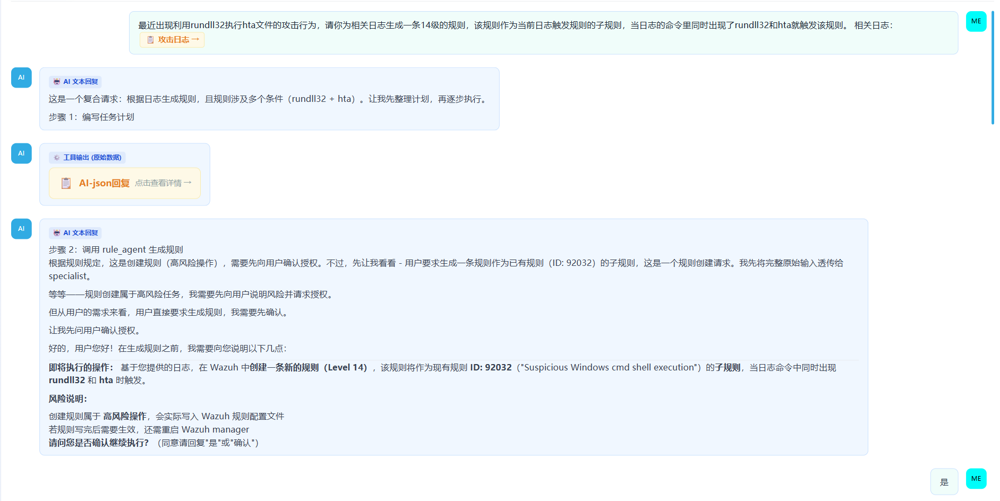

3. 查看系统生成的规则内容；
4. 确认规则无误后执行规则验证；
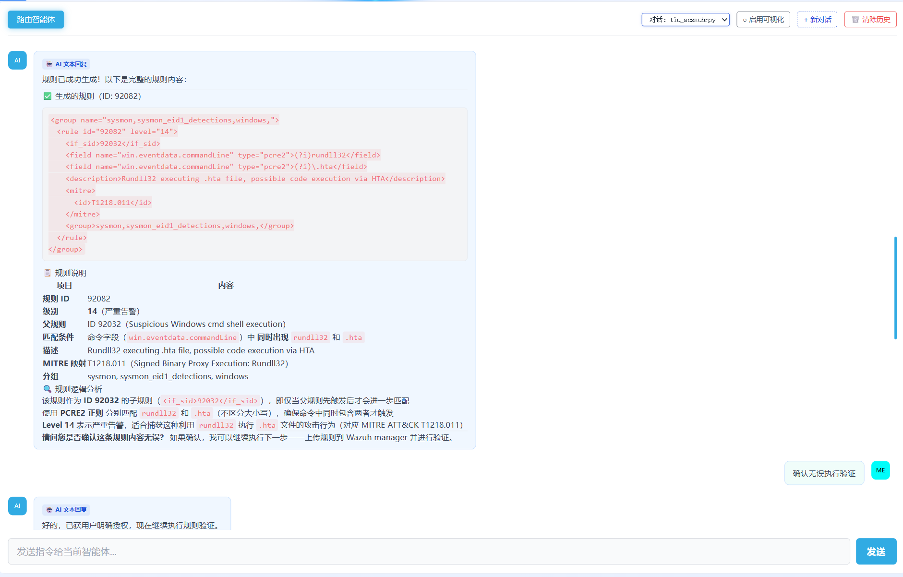
5. 验证通过后确认上传；
6. 进入“规则查询”查看新生成的规则。

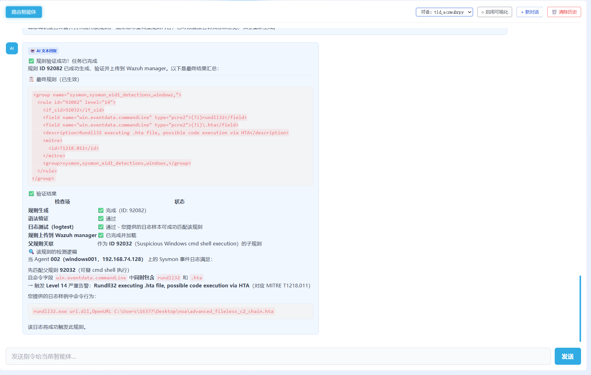

## 2.3 攻击溯源

1. 在“告警查询”中查找与攻击相关的日志；
2. 将日志复制到“AI 对话窗口”；
3. 查看系统提取的主机、时间范围和调查线索；
4. 确认调查信息后，执行完整攻击溯源；

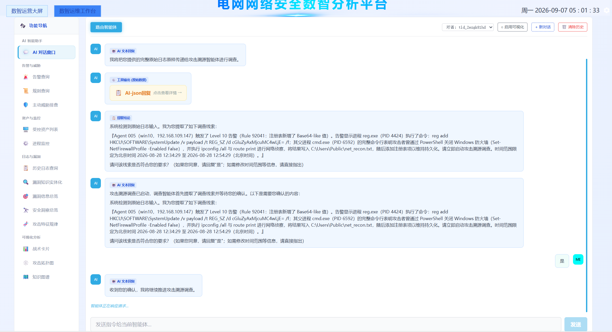
5. 查看或下载生成的调查报告；

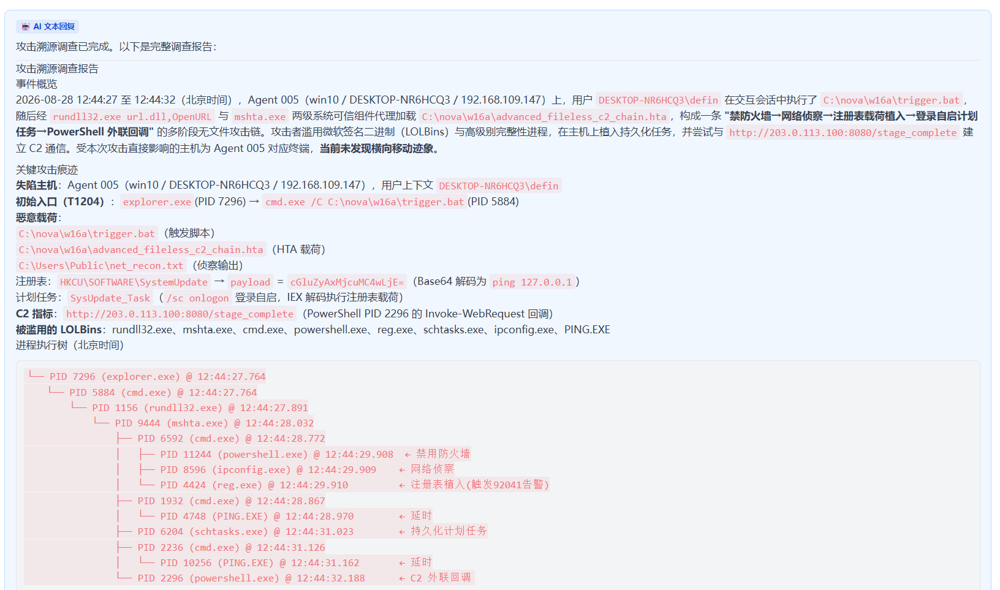

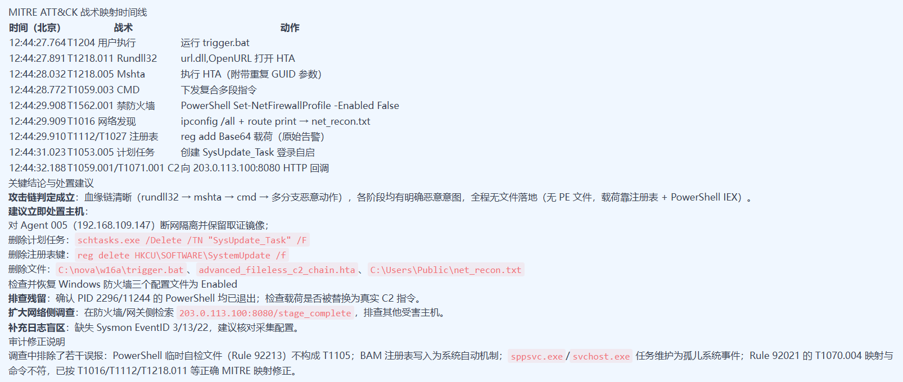
6. 在“战术卡片”和“攻击拓扑图”可以查看可视化结果。

攻击溯源流程会先返回初步调查信息，确认后才继续执行完整调查。可视化按钮默认开启，开启后分析流程可能需要更长时间。


## 2.4 事件响应

事件响应用于通过 AI 对话窗口对受控设备执行指定的安全操作。当前支持以下子功能：

- **IP 封禁**：查询 IP 当前状态，执行单向/双向封禁，并在需要时解封；
- **端口操作**：查询、封禁和解封指定的端口；
- **进程操作**：查询目标设备上的进程，并终止指定进程；
- **账户操作**：查询账户状态，以及禁用或启用指定账户。

### 2.4.1 IP 相关操作

#### 2.4.1.1 IP 状态查询

使用时将 `<AGENT_ID>` 和 `<IP地址>` 替换为实际值。在 AI 对话窗口中输入：

```text
查询 Agent <AGENT_ID> 是否封禁了 <IP地址>
```

根据页面返回结果确认目标 IP 当前是否存在封禁规则。开始新的封禁操作前，应先完成状态查询。

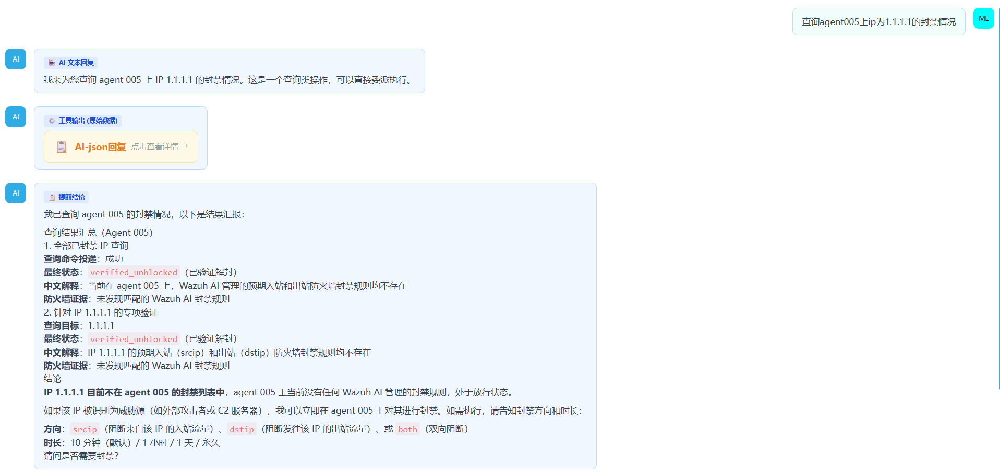

#### 2.4.1.2 IP 封禁

确认目标 IP 当前未被封禁后，在 AI 对话窗口中输入：

```text
在 Agent <AGENT_ID> 上双向封禁 <IP地址>，持续 10 分钟
```

仔细核对目标 Agent、IP、封禁方向和持续时间，确认页面提示后执行。操作完成后查看页面返回的封禁结果，并确认入站和出站规则均已生效。

封禁操作会影响目标设备的网络通信，执行前应确认目标和持续时间。

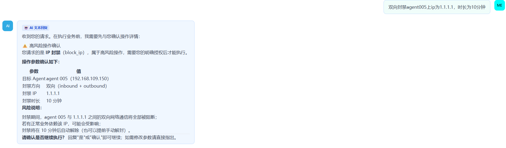

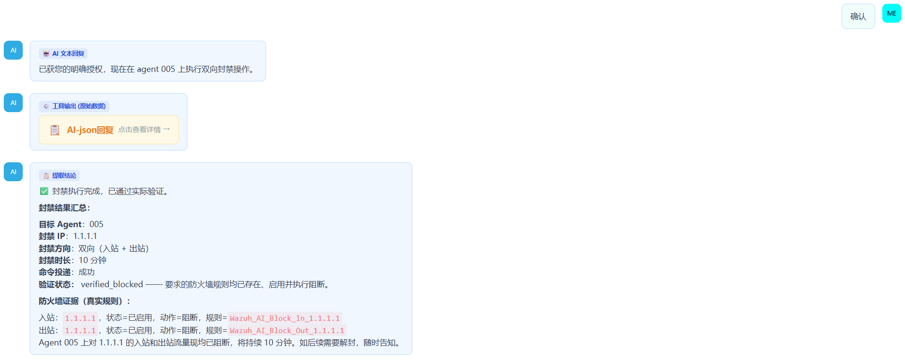

#### 2.4.1.3 IP 解封

需要恢复目标设备网络通信时，在 AI 对话窗口中输入：

```text
在 Agent <AGENT_ID> 上解除对 <IP地址> 的封禁
```

查看页面返回的解封结果，然后再次执行 IP 状态查询，确认封禁规则已经清除。

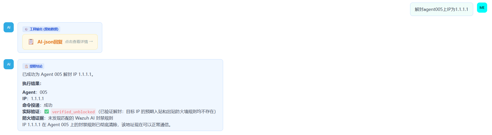

### 2.4.2 端口操作

支持查询、封禁和解封指定的 TCP 端口。执行封禁前应确认目标设备和端口，执行后根据页面返回结果确认操作状态。

### 2.4.3 进程操作

支持查询目标设备上的进程信息，并终止指定进程。执行终止操作前应确认目标进程，避免误操作系统关键进程。

### 2.4.4 账户操作

支持查询指定账户状态，以及禁用和启用账户。执行账户操作前应确认账户名称和目标设备，避免影响正常使用的账户。
